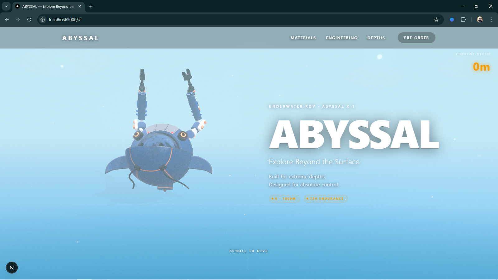
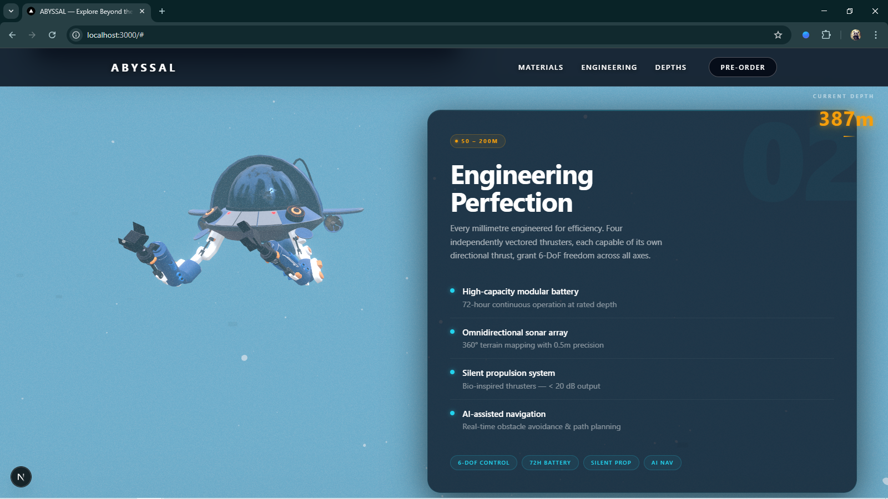
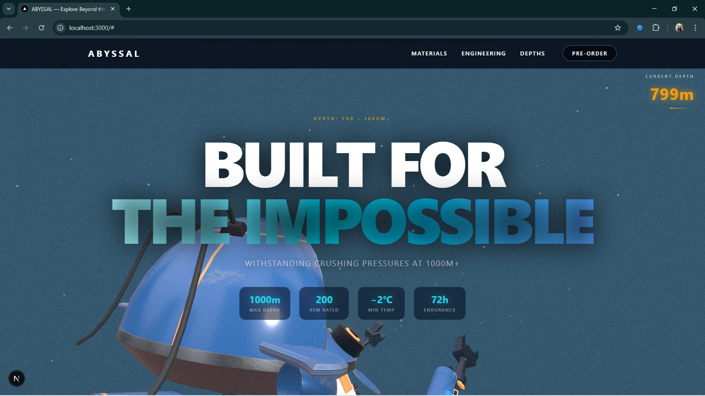
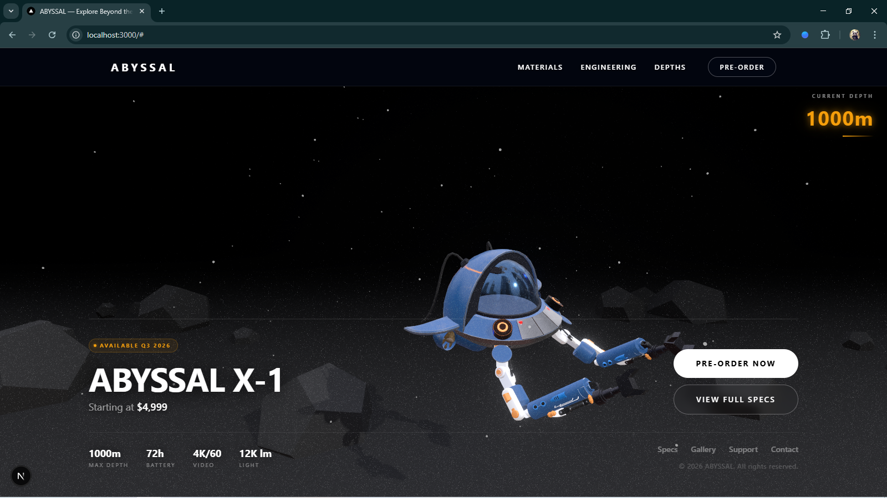

<div align="center">

# Abyssal X-1

**A cinematic, scroll-driven 3D product experience for an underwater drone.**

[](https://nextjs.org)
[](https://threejs.org)
[](https://docs.pmnd.rs/react-three-fiber)
[](https://gsap.com)
[](https://tailwindcss.com)
[](https://www.typescriptlang.org)

</div>

<br />

## 📖 Project Description

A premium product landing page that takes the viewer from the sky surface down to 1000m depth through a fully animated 3D environment. The drone reacts to every scroll. No libraries were faked — every visual effect is real-time. This cinematic experience showcases advanced scroll choreography, responsive Three.js visuals, and procedural 3D environments.

---

## 🔗 Live Demo

**[View Live Experience](https://abyssalx-1.netlify.app/)**

---

## 🎥 Demo Video

**[Watch the Demo Video](https://drive.google.com/file/d/1tkw_Isfm86UBS1755_8VueJhNYRVM2tC/view?usp=sharing)**

---

## 📸 Screenshots

<div align="center">
  
  <br/><br/>
  
  <br/><br/>
  
  <br/><br/>
  
</div>

---

## ✨ Features

- **Scroll-driven 3D drone animation** — GSAP `ScrollTrigger` scrubs a timeline that moves, rotates, and scales a real GLB model through 6 distinct cinematic poses.
- **Section-aware choreography** — Each content section has a designated "clear zone"; the drone parks in the open half to never overlap text.
- **Cinematic post-processing** — Bloom and Noise implemented via `@react-three/postprocessing` (Effect Composer).
- **Atmospheric 3D environment** — Procedural beach, seabed, marine life silhouettes, and atmospheric lighting react to scroll depth.
- **Amber depth HUD** — Fixed depth gauge reads 0 → 1000m as you scroll; amber color ensures readability on every background.
- **Premium glass-morphism UI** — Section cards with backdrop blur, cyan accent borders, section watermarks, spec grids, and progress bars.
- **Fully reversible animation** — GSAP `scrub` auto-reverses all motion on scroll-up; no extra code needed.
- **SSR-safe** — Three.js canvas is dynamically imported with `ssr: false` to avoid server/client hydration mismatches.

---

## 🏗️ Architecture

```text
abyssal/
├── public/
│   └── drone.glb              # Draco-compressed drone model (~38 MB)
│
└── src/
    ├── app/
    │   ├── globals.css         # Design tokens, all custom CSS classes
    │   ├── layout.tsx
    │   └── page.tsx            # Root: Scene (fixed 3D) + Overlay (scrollable HTML)
    │
    └── components/
        ├── canvas/
        │   ├── Scene.tsx           # Canvas setup, lights, post-processing
        │   ├── Drone.tsx           # GLB model + GSAP scroll choreography
        │   ├── EnvironmentEffects.tsx
        │   ├── AtmosphericLights.tsx
        │   ├── Beach.tsx
        │   ├── Seabed.tsx
        │   └── MarineLife.tsx
        │
        └── ui/
            ├── Overlay.tsx         # All 6 scroll sections + HUD
            ├── HeroSection.tsx     # Above-fold hero with GSAP intro animation
            ├── Header.tsx          # Fixed nav with scroll-aware background
            └── LoadingScreen.tsx
```

### Layering Model

```text
┌─────────────────────────────────────┐  z-index: 10  (pointer-events: auto)
│          Overlay / HUD              │  Scrollable HTML + fixed UI
├─────────────────────────────────────┤  z-index: 0
│          Scene (Canvas)             │  Fixed, full-screen WebGL
└─────────────────────────────────────┘
```

The canvas is **fixed** and never scrolls. The HTML overlay sits on top and **is** the scroll container. `#main-scroll-container` is the GSAP `ScrollTrigger` target.

---

## 🎬 Scroll Choreography

| Section | Drone Position | Angle | Screen Side |
|---|---|---|---|
| **Hero** | `(-3.5, 0.8, 0)` | Top-down `x=65°` | LEFT |
| **The Shallows** (0–50m) | `(4.0, 0.2, 2.0)` | Side silhouette `x=0°` | RIGHT |
| **Engineering Perfection** (50–200m) | `(-4.0, 0.2, 2.0)` | Left-side `y=90°` | LEFT |
| **Into the Void** (200–500m) | `(0, -0.5, 3.5)` | Nose-dive `x=30°, y=180°` | CENTER |
| **Built for Impossible** (500–1000m+) | `(-1.0, -3.5, 5.5)` | Low-angle `x=-15°, y=225°` | CENTER-LEFT |
| **Pre-Order** | `(2.0, -1.8, 2.5)` | 3/4 front `y=135°` | RIGHT |

> Card layout always places content on the **opposite side** to the drone, giving the model a natural open stage.

The GSAP timeline uses sequential `to()` tweens (not `fromTo`) so initial values are set exclusively via `gsap.set()` — this prevents the "big drone on first load" flash that `fromTo()` causes by immediately rendering all `from` states.

---

## 🛠️ Tech Stack

| Layer | Technology |
|---|---|
| Framework | Next.js 16.1 (App Router) |
| 3D Engine | Three.js 0.173 + React Three Fiber 9 |
| 3D Helpers | `@react-three/drei` (GLTFLoader, Float, Center, Environment) |
| Post-processing | `@react-three/postprocessing` (Bloom, Noise) |
| Animation | GSAP 3.12 + ScrollTrigger + `@gsap/react` |
| Styling | Tailwind CSS 4 + Vanilla CSS (custom design tokens) |
| Language | TypeScript 5 |

---

## 🚀 Getting Started

### Prerequisites

- **Node.js** ≥ 18
- **npm** ≥ 9

### Installation

```bash
# Clone the repository
git clone https://github.com/Sidspidy/abyssal-experience.git
cd abyssal-experience

# Install dependencies
npm install

# Start the development server
npm run dev
```

Open [http://localhost:3000](http://localhost:3000).

> **Note:** The drone model (`public/drone.glb`) is tracked in the repository. No additional asset download is needed.

### Build & Deploy

```bash
# Production build
npm run build

# Start production server
npm start
```

Deploy to [Vercel](https://vercel.com) with zero configuration — the project uses the Next.js App Router with no server-side dependencies.

---

## 🔑 Implementation Notes

### Why `gsap.set()` Before the Timeline
GSAP's `fromTo()` immediately renders every `from` state the moment the tween is added to a timeline. In a multi-tween timeline, the **last** call wins, leaving the 3D object in the wrong pose on first load. The solution: use `gsap.set()` once to lock all initial values, then use `to()` exclusively so the timeline only drives forward/backward motion.

```ts
// Lock initial state BEFORE timeline creation
gsap.set(droneRef.current.position, { x: -3.5, y: 0.8, z: 0.0 })
gsap.set(droneRef.current.scale,    { x: 1.0,  y: 1.0, z: 1.0  })

// Then drive with to() — reads current state as the from value
tl.to(droneRef.current.position, { x: 4.0, ... })
```

### Why the Depth Gauge is Amber
The site background transitions from bright sky blue (`#5b9fc9`) to pitch black (`#020612`). `cyan-400` — the Three.js accent color — becomes invisible in the shallow sections. Amber (`#f59e0b`) reads clearly on every depth.

### Canvas Rendering Settings
```ts
gl={{ powerPreference: 'high-performance', alpha: false, antialias: false }}
dpr={[1, 1.5]}
```
`antialias: false` + capped DPR reduce GPU load since Bloom post-processing already smooths aliasing.

---

## 📄 License

MIT © 2026 ABYSSAL
